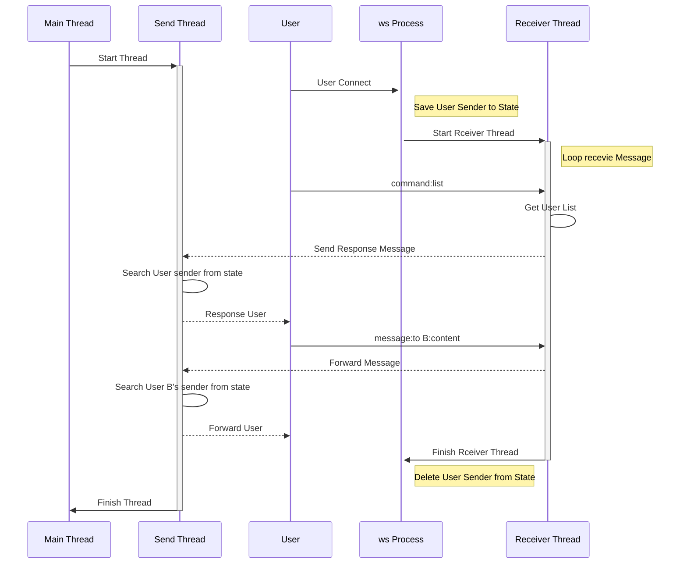

```mermaid
sequenceDiagram
participant M as Main Thread
participant S as Send Thread
participant U as User
participant WS as ws Process
participant R as Receiver Thread

M ->>+ S: Start Thread
U ->>+ WS: User Connect
note right of WS: Save User Sender to State
WS ->>+ R: Start Rceiver Thread

note right of R: Loop recevie Message
U ->> R: command:list
R -> R: Get User List
R -->> S: Send Response Message
S -> S: Search User sender from state
S -->>U: Response User

U ->> R: message:to B:content
R -->> S: Forward Message
S -> S: Search User B's sender from state
S -->>U: Forward User

R ->>- WS: Finish Rceiver Thread
note right of WS: Delete User Sender from State
S ->>- M: Finish Thread

```
